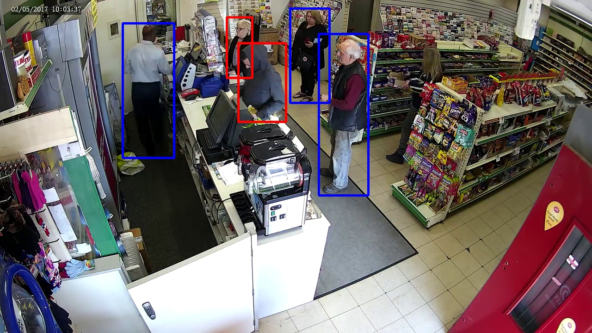

# social-distance
Social Distance is a program designed to monitor images from webcam, detect people, compute distance between them and indicate small distance with red.

## installation
Download [yolov4-p5.pt](https://drive.google.com/file/d/1aXZZE999sHMP1gev60XhNChtHPRMH3Fz/view?usp=sharing) and place it to scaled_yolov4 folder.

## how to use
cd social-distance
python3 demo.py

## references
The project uses ScaledYOLOv4 to detect people. Please find original imlementation here: https://github.com/WongKinYiu/ScaledYOLOv4
Example image was generated from this video: https://www.youtube.com/watch?v=nYZldluUf4c

